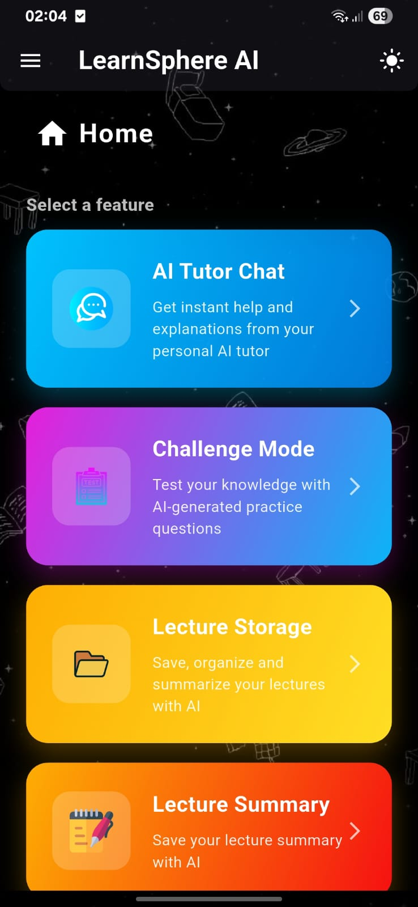
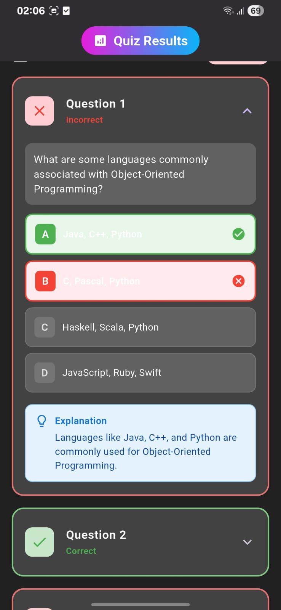

# LearnSphere AI

<p align="center">
  
</p>

<p align="center">
  <strong>An intelligent learning platform powered by AI</strong>
</p>

<p align="center">
  <a href="#features">Features</a> •
  <a href="#screenshots">Screenshots</a> •
  <a href="#tech-stack">Tech Stack</a> •
  <a href="#getting-started">Getting Started</a> •
  <a href="#project-structure">Project Structure</a> •
  <a href="#license">License</a>
</p>

---

## Overview

LearnSphere AI is a comprehensive AI-powered learning assistant built with Flutter. It leverages OpenAI's GPT models to provide students with an interactive tutoring experience, lecture summarization, quiz generation, and organized study materials.

**Developed by Terry Mardaymootoo**

---

## Features

### 🤖 AI Tutor Chat
- Interactive chatbot powered by GPT-3.5 Turbo
- Step-by-step explanations and guided learning
- Conversation history for review
- Encourages critical thinking over direct answers

### 📚 Lecture Storage
- Upload and organize lecture notes (PDF support)
- Module-based organization
- Cloud storage with Firebase

### 📝 Lecture Summary
- AI-powered summarization of lecture content
- Handles large documents through intelligent chunking
- Save and review summaries

### 🎯 Challenge Mode
- Auto-generated quizzes from lecture content
- Multiple difficulty levels (Easy, Medium, Hard)
- Customizable question count
- Quiz history and performance tracking

### 🎨 Additional Features
- Beautiful animated splash screen
- Onboarding flow for new users
- Dark/Light theme support
- Google Sign-In authentication

---

## Screenshots

### Authentication & Home
<p align="center">
  
  &nbsp;&nbsp;
  
</p>

### AI Tutor Chat
<p align="center">
  
</p>

### Lecture Storage & Organization
<p align="center">
  
  &nbsp;&nbsp;
  
</p>

### Lecture Summarization
<p align="center">
  
  &nbsp;&nbsp;
  
</p>

### Challenge Mode & Quizzes
<p align="center">
  
  &nbsp;&nbsp;
  
</p>

### Quiz Results & Performance
<p align="center">
  
  &nbsp;&nbsp;
  
  &nbsp;&nbsp;
  
</p>

---

## Tech Stack

| Category | Technology |
|----------|------------|
| **Framework** | Flutter 3.9+ |
| **Language** | Dart |
| **State Management** | GetX, Provider |
| **Backend** | Firebase (Auth, Firestore, Storage, Cloud Functions) |
| **AI** | OpenAI GPT-3.5 Turbo |
| **Local Storage** | Hive |
| **PDF Processing** | Syncfusion Flutter PDF |
| **Animations** | Lottie, Flutter Animate |

---

## Getting Started

### Prerequisites

- Flutter SDK 3.9.2 or higher
- Dart SDK 3.9.2 or higher
- Firebase CLI
- Node.js 18+ (for Cloud Functions)
- An OpenAI API key
- A Firebase project

### Installation

1. **Clone the repository**
   ```bash
   git clone https://github.com/Terry-M26/learn_sphere_ai.git
   cd learn_sphere_ai